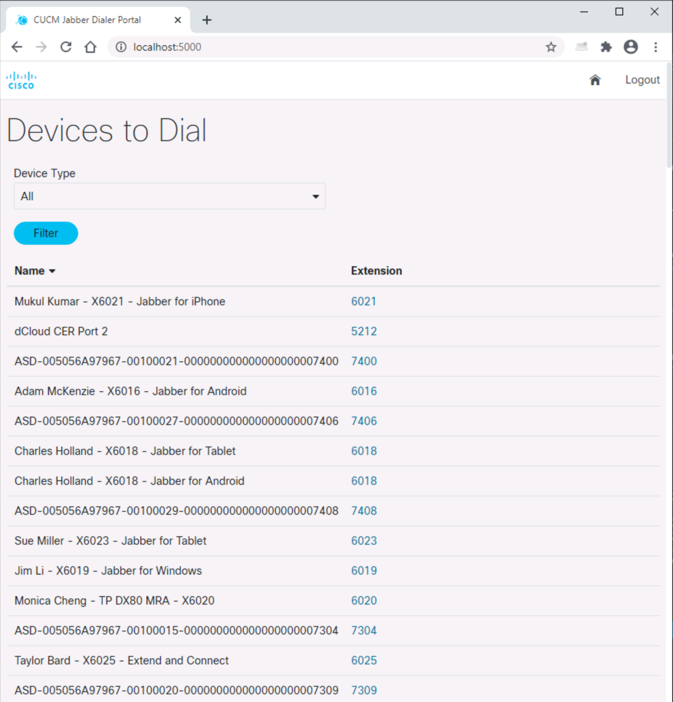
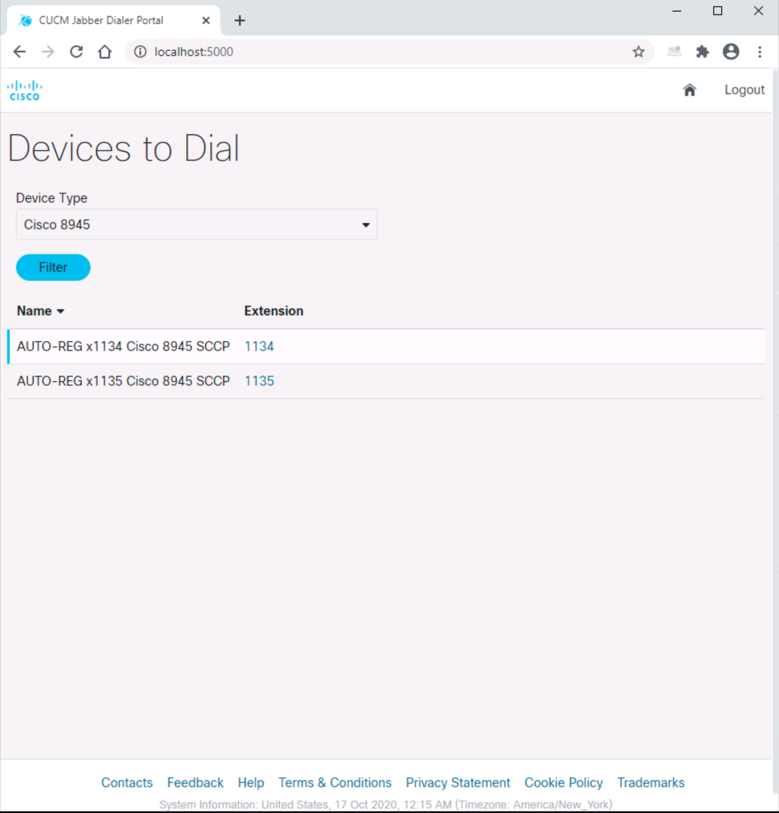
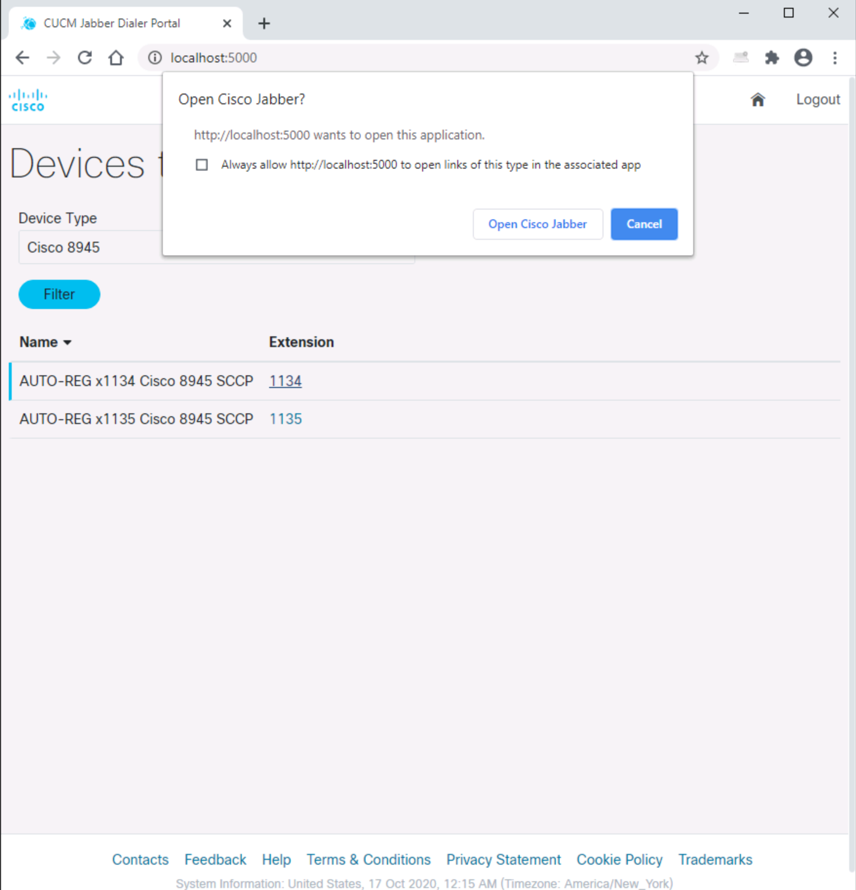
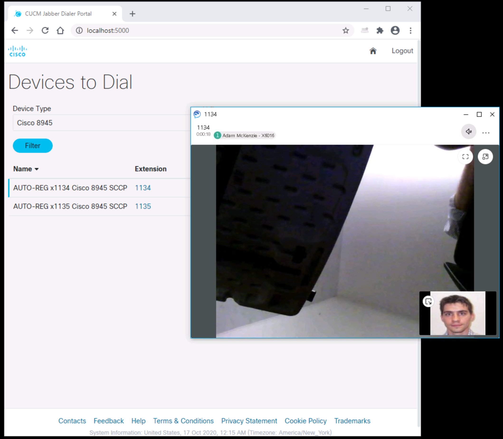

# CUCM Jabber Dialer Portal

This sample code can be used to retrieve a list of devices from Cisco Unified Communications Manager using
 the AXL Soap API and a SQL Query to also extract the extension number assigned to each device. 
The information is then showed in a web page where the extension number is displayed as a link that triggers the Jabber Protocol Handler 
 to have Jabber dial the number.  

This is useful for organizations that need to provide Jabber users with a directory of video devices to which they can dial, such as 
video enpoints located in different hospital rooms to be able to reach specific patients. The device name can contain the room number which 
makes it easy to dial that room.  

The sample code shows how you can filter the list based on device type, so that a CUCM installation with many IP phones and just a few 
Collaboration Room and Desk devices such as DX80s can limit the list of devices to dial to just one particular type. 
 

## Contacts
* Gerardo Chaves (gchaves@cisco.com)
* Girish Vyas (givyas@cisco.com)

## Solution Components
* flask
* python
* Javascript
* html
* css

## Requirements
 - Python 3 (minimum 3.7)
 - AXLSQLToolkit (Download from your CUCM Plugins page https://developer.cisco.com/docs/axl/#!download-the-axl-wsdl/download-the-axl-wsdl)
 - A CUCM Environment (VMs included)
 - VPN to be on the same network as CUCM 

## Installation

It is recommend to set up your environment as followed, to use this frontend template:

In the CLI:
1.	Choose a folder, then create and activate a virtual environment for the project
    ```python
    #WINDOWS:
    py -3 -m venv [add name of virtual environment here] 
    source [add name of virtual environment here]/Scripts/activate
    #MAC:
    python3 -m venv [add name of virtual environment here] 
    source [add name of virtual environment here]/bin/activate
    ```

2. Access the created virtual enviroment folder
    ```python
    cd [add name of virtual environment here] 
    ```

3.	Clone this Github repository into the virtual environment folder.
    ```python
    git clone https://github.com/gve-sw/CUCM_Jabber_Dialer_Portal
    ```


4.	Install dependencies
    ```python
    pip install -r requirements.txt
    ```

- This sample code can be tested using a Cisco dCloud demo instance that contains the CUCM VM such as the one titled  
[Cisco Collaboration 12.5 v1 - Transform Work with Collaboration](https://dcloud2-rtp.cisco.com/content/demo/578984?returnPathTitleKey=content-view)
 - Install the AXLSQLToolkit files by going into the CUCM admin page, Go to Application | Plugins. Click on the Download link by the Cisco CallManager AXL SQL Toolkit Plugin. The axlsqltoolkit.zip file contains the complete schema definition for different versions of Cisco Unified CM.
 - Make sure the user being used has a user rank of 1 or with proper API AXL permissions (Role: Standard AXL API Access Reference: https://www.cisco.com/c/en/us/td/docs/voice_ip_comm/cucm/admin/9_0_1/ccmsys/CUCM_BK_CD2F83FA_00_cucm-system-guide-90/CUCM_BK_CD2F83FA_00_system-guide_chapter_0100.pdf)
 - If using the a "Transform Work with Collaboration" dCloud demo instance, copy 'dcloud_sample_env.py' to 'user_env.py'. It contains appropriate values for CUCM_LOCATION , CUCM_USER and CUCM_PASSWORD to use that demo. You still have to provide the value for WSDL_PATH depending on where you copy the 'AXLAPI.wsdl' on one of the 
   Windows virtual machines in the demo or on your local machine (if connecting via VPN).
 - Otherwise, copy 'user_env.template' to 'user_env.py' and then edit 'user_env.py' and add your CUCM environment and user details WSDL_PATH = "(path to WSDL file)" CUCM_LOCATION = "(IP Address)" CUCM_USER = "(username without domain Example user: amckenzie)" CUCM_PASSWORD = "(password)"


## Usage

### Initial test mode

To accomodate for any changes you might want do in the way the list of devices is presented and 
the filtering options, the code uses a boolean named **runningLocal**  to determine if it will actually 
attempt to make the AXL/SOAP calls into Cisco Unified Communications Manager to retrieve the list of devices 
or just use some sample hard-coded values.  
Please set the value of **runningLocal** to False in line 46 of **app.py** to have the code use data from CUCM

### Running the application

Once properly configured, you can launch the application by running the **app.py** script:
```python app.py```

You can then navigate with a Web Browser to http://0.0.0.0:5000/ if you keep the defaults in this code or whatever destination 
you specify when running the Flask application. 

You will now be presented with an initial page with all devices configured in CUCM:



If you wish to limit the number of devices being shown, use the pull down menu under Device Type, select a specific device type and click on the Filter button



You can now click on the extension number showns for a particular device and that will invoke Cisco Jabber if installed on your desktop so it can call the extension on that device:


Once you confirm, it will proceed to launch Jabber and place the call:


### LICENSE

Provided under Cisco Sample Code License, for details see [LICENSE](LICENSE.md)

### CODE_OF_CONDUCT

Our code of conduct is available [here](CODE_OF_CONDUCT.md)

### CONTRIBUTING

See our contributing guidelines [here](CONTRIBUTING.md)

#### DISCLAIMER:
<b>Please note:</b> This script is meant for demo purposes only. All tools/ scripts in this repo are released for use "AS IS" without any warranties of any kind, including, but not limited to their installation, use, or performance. Any use of these scripts and tools is at your own risk. There is no guarantee that they have been through thorough testing in a comparable environment and we are not responsible for any damage or data loss incurred with their use.
You are responsible for reviewing and testing any scripts you run thoroughly before use in any non-testing environment.